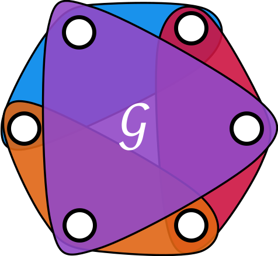

<div align="center" id="top"> 
  

  &#xa0;

</div>

<h1 align="center">HGIN</h1>

<p align="center">
  

  

  

  

  <!--  -->

  <!--  -->

  <!--  -->
</p>

<!-- Status -->

<!-- <h4 align="center"> 
	🚧  Ia_hgin 🚀 Under construction...  🚧
</h4> 

<hr> -->

<p align="center">
  <a href="#dart-about">About</a> &#xa0; | &#xa0; 
  <a href="#sparkles-features">Features</a> &#xa0; | &#xa0;
  <a href="#rocket-technologies">Technologies</a> &#xa0; | &#xa0;
  <a href="#white_check_mark-requirements">Requirements</a> &#xa0; | &#xa0;
  <a href="#checkered_flag-starting">Starting</a> &#xa0; | &#xa0;
  <a href="#memo-license">License</a> &#xa0; | &#xa0;
  <a href="https://github.com/{{YOUR_GITHUB_USERNAME}}" target="_blank">Author</a>
</p>

<br>

This repository contains the source code for the paper "How Powerful are Hypergraph Neural Networks?" published in xxx by [Yifan Feng](https://fengyifan.site/), Rizhuo Huang, Yifan Zhang, Shaoyi Du, Shihui Ying, Zongze Wu, Yue Gao*. This paper is available at [here](xxx).

## :dart: About HGIN

Isomorphism recognition is crucial for analyzing complex network structures. Traditional methods like Weisfeiler-Lehman (WL) kernels and various GNNs often overlook higher-order interactions essential for practical applications. Besides, hypergraph WL kernels struggle to distinguish uniform-regular hypergraphs due to their focus on neighborhood connectivity without effectively capturing unique higher-order structures.
To overcome these issues, we introduce the Hypergraph Identity-Aware Subtree (IA Subtree) Kernel, which distinguishes uniform-regular hypergraphs by considering both neighborhood connectivity and connection density. This kernel detects subtle differences in hypergraph structures via variations in Closed Paths of different lengths.
Additionally, we develop two Hypergraph Neural Networks: Hypergraph Isomorphism Networks (HGIN) and Identity-Aware Hypergraph Isomorphism Networks (IA-HGIN). These models combine the strengths of the Hypergraph WL subtree kernel with advanced neural architectures, improving classification by integrating features from closed-path distributions.
We also provide the first comprehensive theoretical comparison of expressive power between kernel-based methods and neural networks, confirming IA-HGIN's superior performance. Experimental results on eight synthetic and eight real hypergraph datasets validate the effectiveness of our methods over existing State-of-the-Art approaches.

## :sparkles: Features 

:heavy_check_mark: Feature 1;\
:heavy_check_mark: Feature 2;\
:heavy_check_mark: Feature 3;

## :rocket: Technologies 

The following tools were used in this project:

- [Expo](https://expo.io/)
- [React](https://pt-br.reactjs.org/)
- [React Native](https://reactnative.dev/)
- [TypeScript](https://www.typescriptlang.org/)

## :white_check_mark: Requirements 

Before starting :checkered_flag:, you need to have [Git](https://git-scm.com) and [Node](https://nodejs.org/en/) installed.

## :checkered_flag: Starting 

```bash
# Clone this project
$ git clone https://github.com/iMoonLab/HGIN

# Access
$ cd ia_hgin

# Install dependencies
$ yarn

# Run the project
$ yarn start

# The server will initialize in the <http://localhost:3000>
```

## :memo: License 

This project is under license from MIT. For more details, see the [LICENSE](LICENSE.txt) file.


Made with :heart: by <a href="https://fengyifan.site" target="_blank">Yifan Feng</a>

&#xa0;

<a href="#top">Back to top</a>
